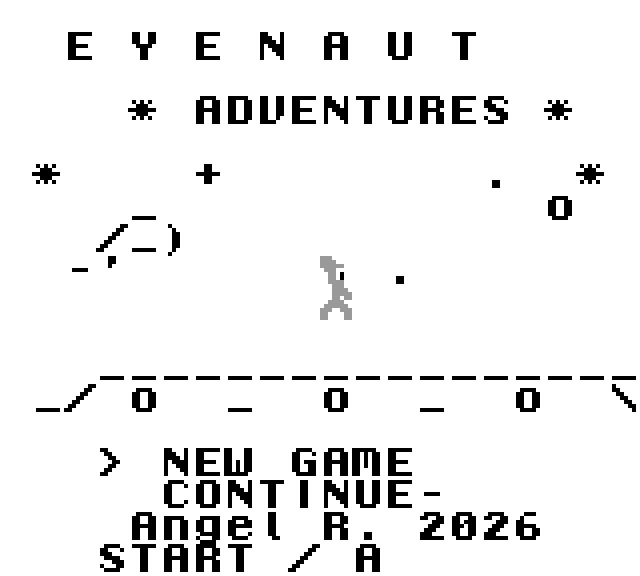
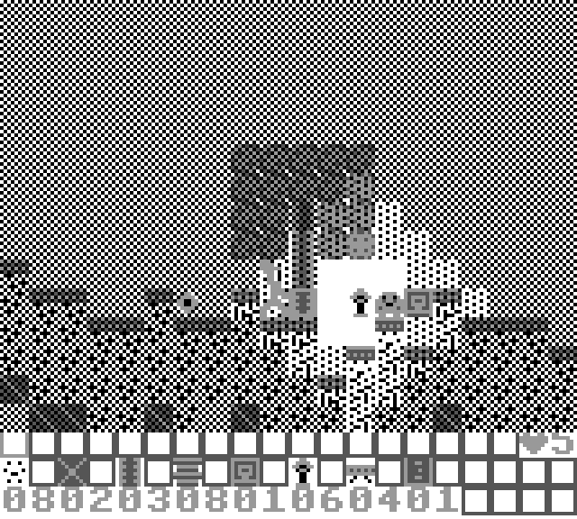
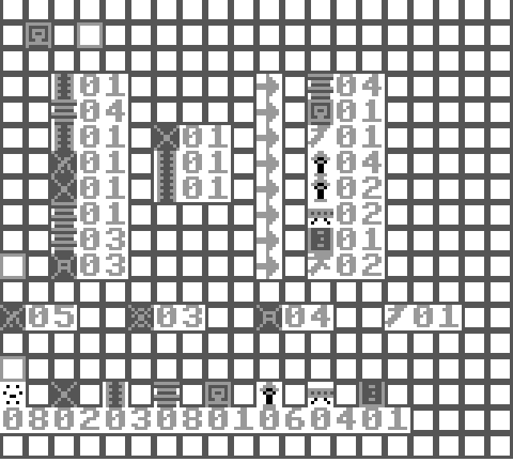
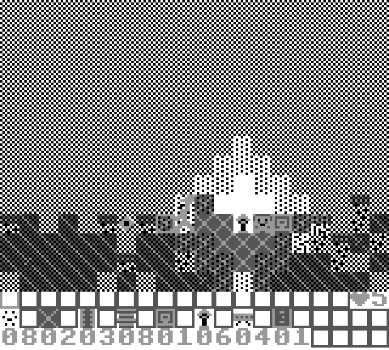

# gb-eyenaut-adventures

A deliberately small Game Boy / DMG homebrew prototype in C using GBDK-2020. The goal is to explore a destructible tile adventure while staying honest about original Game Boy limits.

## Screenshots

| Title screen | Exploration |
| --- | --- |
|  |  |

| Crafting | Celestial Ruins |
| --- | --- |
|  |  |

## Target

- Nintendo Game Boy / DMG.
- C with GBDK-2020.
- Optional RGBDS for assembly experiments and later optimization.
- Register-driven SFX and a compact CH2 soundtrack loop.
- No GB Studio or large engine.

## Build

Open a new WSL shell after setup so `~/.bashrc` exports `GBDK_HOME` and updates `PATH`.

```sh
cd ~/git/gb-eyenaut-adventures
make doctor
make tools-check
make clean
make
```

Use `make doctor-wslg` when you specifically want to verify WSLg display support.

The ROM is written to:

```text
build/eyenaut-adventures.gb
```

### Docker

You can build without installing the toolchain on the host:

```sh
make docker-build
make docker-make
```

See [docs/DOCKER.md](docs/DOCKER.md) for Windows PowerShell, WSL, Linux, and interactive shell examples.

## Run

Recommended from WSL:

```sh
cd ~/git/gb-eyenaut-adventures
make run-wslg
```

`run-wslg` checks WSLg and then starts the SDL/PyBoy path, which is the most reliable Linux GUI option on this machine.

```sh
make run
```

By default `make run` uses the `emulicious` launcher. On WSL, Java and WSLg must both be working for that Linux GUI path. BGB is a strong Windows-side debugger alternative: build in WSL, then open the ROM from Windows.

If Emulicious opens as an invisible WSLg window, try the SDL-based PyBoy fallback:

```sh
make run-pyboy
```

If WSLg still creates invisible windows, this target opens the ROM from WSL using Windows interop:

```sh
make run-windows
```

That target uses the Windows default app associated with `.gb` files. You can also build in WSL and open this ROM manually from a Windows-native emulator:

```text
\\wsl$\Ubuntu\home\arfipod\git\gb-eyenaut-adventures\build\eyenaut-adventures.gb
```

See `docs/SETUP.md` for WSLg troubleshooting notes.

## Tools

- [Audio tool](docs/AUDIO_TOOL.md): open `tools/gbdk_audio_piano_recorder.html` in a browser to record pulse-based Game Boy melody sketches, edit the step grid, and export `GBSongNote` C headers for the current CH2 music engine.

## Controls

- Left / Right: move.
- Up: jump.
- Hold A: mine the aimed block and add it to the inventory when it breaks.
- B: place the selected inventory block, or open/close the aimed door.
- Start: select the next inventory slot.
- Hold Up or Down while using A/B to aim above or below.
- Hold Down while standing on a platform to drop through it.
- Select: open or close the crafting menu.
- In the crafting menu, Left / Right / Up / Down chooses a recipe, A crafts, and B closes.

## Crafting

The crafting menu shows input tiles on the left and the output on the right. Missing materials blink after a failed craft and play the error SFX. The lock icon is reserved for recipes that need a nearby workbench.

Current recipes:

- Wood -> planks.
- Planks -> workbench.
- Wood + stone -> basic stone pickaxe.
- Coal + wood -> torches.
- Stone + wood -> torches.
- Planks -> platforms.
- Planks -> door.
- Iron -> better pickaxe, near a workbench.

The current tool system is global and has no durability. Hand mining works for soft blocks; stone and ores need the basic stone pickaxe. Blocks have mining time: dirt breaks quickly, stone is slower, and ores take longer.

Mined blocks become small pickup drops in the world. Drops fall until they hit solid ground, auto-pick when the player overlaps them, and remain on the ground if the inventory is full.

The world is split into four lightweight procedural biomes: Meadow, Rootwood Grove, Stone Belt, and Celestial Ruins. They reuse the same tile set but vary terrain height, trees, caves, surface material, and ore density.

## Roadmap

- Persist the current seed + changed-tile log in battery SRAM.
- Integrate hUGEDriver after the core prototype loop feels good.
